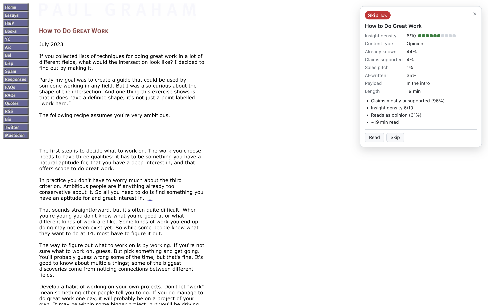
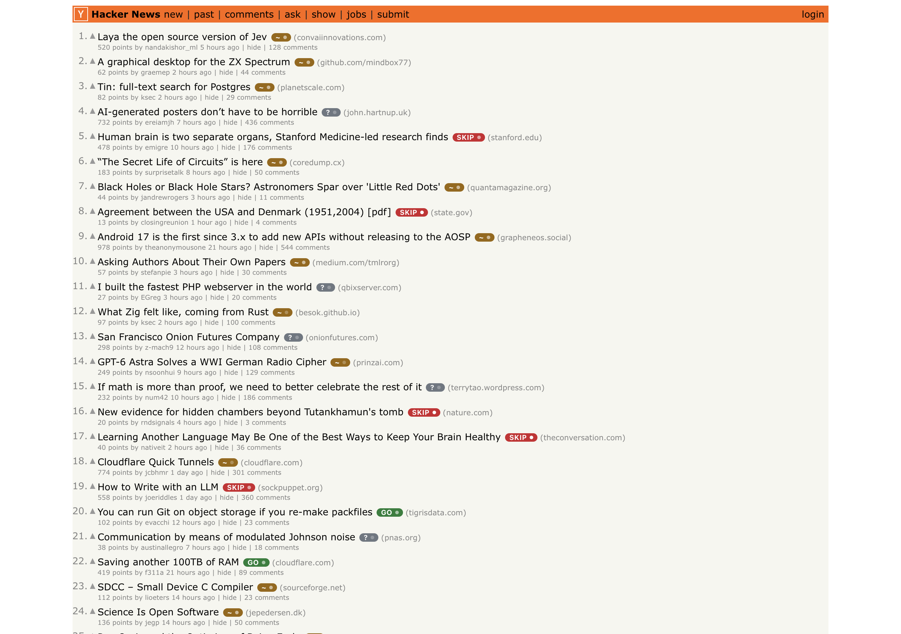
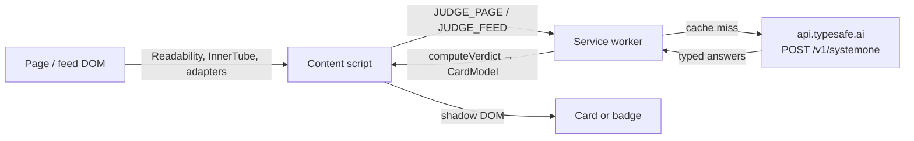
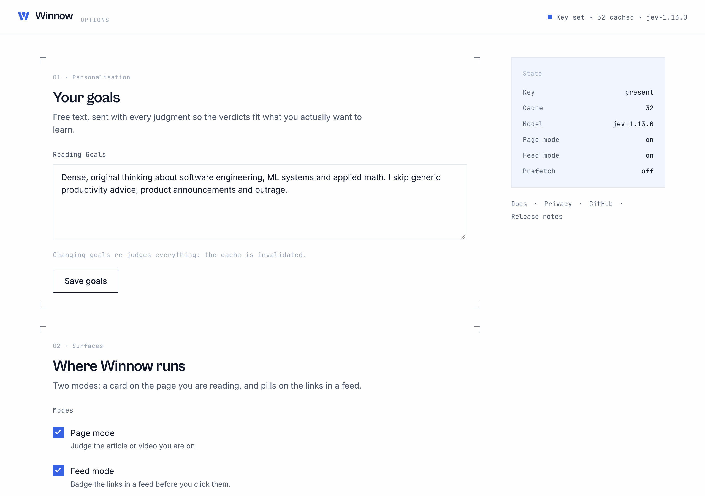

<p align="center">
  
</p>

<p align="center"><strong>Less noise. More signal.</strong><br><em>Know before you click.</em></p>

<p align="center">
  <a href="LICENSE"></a>
  <a href="https://github.com/ThinkyMiner/Winnow/actions/workflows/ci.yml"></a>
  <a href="https://github.com/ThinkyMiner/Winnow/releases/latest"></a>
</p>

Winnow is a Chrome extension that tells you whether an article or video is worth your time before you spend it. It reads the page (or the feed you are scrolling), asks [Jev](https://typesafe.ai) from TypeSafe a fixed set of typed questions, and turns the answers into one of four verdicts: **read now**, **skim**, **save**, or **skip**. Jev returns probabilities, never prose, so every word on the card is a template filled from typed answers. You bring your own Jev key; nothing goes through a server of ours.

Website: https://winnow-seven.vercel.app

<p align="center">
  
</p>

## What it does

**Page mode.** On any article or YouTube watch page, a card in the top-right corner shows the verdict with its confidence, plus insight density (1–10), content type, how likely you already know it, whether its claims are supported, whether it is an undisclosed sales pitch, whether it reads as AI-written, and where the payload sits. On videos with captions, "Skip to" chips seek the player to the segment Jev picked as the core idea. Two buttons, **Read** and **Skip**, feed your reader state.

**Feed mode.** On Hacker News, YouTube home/subscriptions/search, and any page with many external links, each link that scrolls into view gets a small badge (`GO`, `~`, `SAVE`, `SKIP`, or `?`). Hover or focus it to see the full card. Items are judged in batches of up to 12 per Jev call and cached for seven days, so a second visit to the same front page costs nothing.

<p align="center">
  
  <br>
  
</p>

**Reader state.** Your reading goals (free text in options), the topics of pages you have had judged in the last 30 days, and your last few Read/Skip clicks are summarised into every request. "Worth it" means worth it for you. Changing your goals invalidates the cache.

## Why typed answers, never prose

Jev is a "System One" model: it answers questions of three fixed types (`noul` for yes/no probability, `choice` over named options, `score` over ordered levels) and returns calibrated probabilities for each. It does not generate text. Winnow leans on that:

- The card can only say things the code has a template for. A model cannot hallucinate a summary, quote, or reason onto your screen.
- Thresholds are numbers you can move in options, and the verdict is a pure function you can read in [`src/jev/verdict.ts`](src/jev/verdict.ts).
- Every judgment can be replayed offline against [40 fixtures](fixtures/) with `pnpm eval`.

The observed API behaviour is written down in [docs/jev-contract.md](docs/jev-contract.md); the code is built to exactly that.

## Install

Winnow is not on the Chrome Web Store yet. Install from a release zip:

1. Download `Winnow-vX.Y.Z.zip` from the [latest release](https://github.com/ThinkyMiner/Winnow/releases/latest) and unzip it.
2. Open `chrome://extensions`, turn on **Developer mode**, click **Load unpacked**, and pick the unzipped folder.
3. The onboarding page opens. Paste a Jev API key from [console.typesafe.ai](https://console.typesafe.ai) and click **Verify**. Winnow makes one call to `GET /v1/models` and stores the key only if that succeeds.
4. Optional: click the toolbar icon to open options and type your reading goals.

**Cost.** Jev bills $0.042 per million input tokens; output is free. One Hacker News front page (30 links) is about 34,000 tokens, roughly $0.0015. A long article is 2,000–8,000 tokens.

Long-form instructions and troubleshooting: [docs/install.md](docs/install.md).

## How it works

1. **Extract.** The content script pulls readable text with Mozilla Readability (articles) or the caption track via YouTube's InnerTube player endpoint (videos). Feed adapters collect title + snippet for each visible link.
2. **Message.** The content script sends `JUDGE_PAGE` or `JUDGE_FEED` to the service worker. Content scripts never see your key.
3. **Judge.** The service worker checks the cache, builds one Jev request (state + up to 11 typed questions, or 7 per item in feed batches) and calls `POST /v1/systemone`. This is the only place in the extension that talks to Jev.
4. **Decide.** `computeVerdict` applies ordered threshold rules to the parsed answers and produces a label, a confidence, and templated reasons.
5. **Render.** The card or badge is rendered inside a shadow root so the host page's CSS cannot touch it and vice versa.



Deeper: [docs/architecture.md](docs/architecture.md), [docs/how-judgments-work.md](docs/how-judgments-work.md).

## Configuration

Click the toolbar icon (or right-click → Options). The options page has:

| Section | What you can change |
|---|---|
| Reading goals | Free text sent with every judgment. Saving bumps the reader-state version and invalidates the cache. |
| Modes | Page mode on/off; feed mode on/off; per-site toggles for Hacker News, YouTube, other link lists. |
| Prefetch link text | Fetch each feed link's page in the service worker so Jev sees body text, not just the title. Requests the `<all_urls>` permission when you turn it on. |
| Excluded hosts | One hostname per line; matches the host and its subdomains. `http:` pages, `localhost`, and private networks are always excluded. |
| Thresholds | Eleven sliders, one per rule knob, with a reset button. |
| Data | Clear the judgment cache; reset reader state (goals, topics, feedback). |
| API key | Verify and replace the stored key. |

<p align="center">
  
</p>

Every slider, constant, and default is listed in [docs/configuration.md](docs/configuration.md).

## Privacy

- Page text, transcripts, feed titles and snippets, your goals text, and the titles of items you marked Read/Skip go to `api.typesafe.ai` and nowhere else.
- Your key, settings, reader state, and cache live in `chrome.storage.local` on your machine.
- No analytics, no telemetry, no server of ours.

Full policy, permissions, and how to delete everything: [docs/privacy.md](docs/privacy.md).

## Development

Node 20 or newer and pnpm 10.

```sh
pnpm install
pnpm build        # → dist/, load it unpacked
```

| Command | What it does |
|---|---|
| `pnpm dev` | Vite dev server; open `/dev/preview.html` to render cards and badges from fixture data, no Jev needed |
| `pnpm build` | Build the extension into `dist/` |
| `pnpm typecheck` | `tsc --noEmit` |
| `pnpm test` | 124 unit tests (Vitest) |
| `pnpm eval` | Judge the 40 fixtures with real Jev calls, print confusion matrices, suggest thresholds |
| `pnpm probe` | One raw Jev call; prints the response body |

```
src/types.ts          frozen contracts and message protocol
src/config.ts         model pin, limits, thresholds, storage keys
src/background/       service worker: router, storage, the only Jev caller
src/jev/              client, questions, verdict, cache, reader state
src/extract/          Readability, YouTube captions, feed adapters, prefetch
src/ui/               shadow-DOM card and badge, templates, styles
src/content/          page.ts and feed.ts glue
src/onboarding/       key entry on first install
src/options/          goals, toggles, sliders, cache and key management
scripts/eval/         eval harness; fixtures/ holds items and goldens
dev/                  preview page for the UI
docs/                 everything below
```

| Doc | Read it when |
|---|---|
| [docs/architecture.md](docs/architecture.md) | You want the module map, message protocol, cache keying, and sequence diagrams |
| [docs/how-judgments-work.md](docs/how-judgments-work.md) | You want every question and every verdict rule, in order |
| [docs/configuration.md](docs/configuration.md) | You want every threshold and constant with its default |
| [docs/editing-questions.md](docs/editing-questions.md) | You are changing what Winnow asks Jev |
| [docs/adding-a-feed-adapter.md](docs/adding-a-feed-adapter.md) | You want badges on another site |
| [docs/eval.md](docs/eval.md) | You are touching questions or thresholds and need to measure it |
| [docs/development.md](docs/development.md) | Setup, testing conventions, release process |
| [docs/install.md](docs/install.md) | Install, troubleshoot, update, uninstall |
| [docs/faq.md](docs/faq.md) | Short answers to the usual questions |
| [docs/privacy.md](docs/privacy.md) | What leaves your machine and what stays |
| [docs/jev-contract.md](docs/jev-contract.md) | Observed Jev API behaviour; the source of truth |

## Contributing

Small PRs, `pnpm typecheck && pnpm test` green, one module per PR. See [CONTRIBUTING.md](CONTRIBUTING.md).

**Got a wrong verdict?** Open a [Wrong verdict](https://github.com/ThinkyMiner/Winnow/issues/new?template=wrong-verdict.yml) issue with the URL, the verdict you saw, and the one you expected. Good reports become eval fixtures: a JSON file in `fixtures/items/` plus a golden entry, so the mistake is measured every time thresholds move. The recipe is in [docs/eval.md](docs/eval.md).

## Known limits

- **Paywalls and login walls.** The card judges whatever Readability can see. A teaser paragraph is judged as the article.
- **Feed items are judged on title + snippet by default.** Body-dependent rules (low density, AI-written, unsupported claims, and the read-now density gate) only fire at full depth. Badges lean on content type, goal fit, already-known, sales pitch, and Jev's own verdict.
- **Videos without captions** are judged on title and description at snippet depth, with no Skip-to chips. Caption URLs embedded in the watch page are token-gated and return empty bodies; Winnow fetches tracks through the InnerTube player endpoint instead, which can break when YouTube changes it.
- **Insight density saturates.** Polished opinion pieces and tutorials often score 9–10, like original research. Rage bait and advertorials that argue for their own classification can move the answer.
- **Accuracy.** Against the unreviewed goldens, the held-out split scores 80% verdict agreement and 90% content-type agreement.
- **No client-side throttle.** The client retries on 429 with backoff but does not pace itself against the account limits (250k tokens/s, 1,200 req/min).

## Roadmap

1. Split the insight-density question so "polished" and "original" stop scoring the same.
2. Human-reviewed goldens (`reviewed: true` in `fixtures/golden.json`).
3. A caption-path fixture for the YouTube extractor, and a visible failure state on the card when captions could not be fetched.

## Brand

Brand assets live in [`assets/brand/`](assets/brand/):

- **Mark**: `mark.svg` (Winnow Blue), `mark-white.svg`, `mark-ink.svg`; `favicon.svg` is the blue mark.
- **Lockups**: `logo.svg` (mark + wordmark, Ink) and `logo-white.svg`.
- **App icons**: `app-icon-primary.png` (white mark on blue), `app-icon-light.png`, `app-icon-dark.png` at 512 px; the extension icons in `public/icons/` (16, 32, 48, 128) are the primary icon.
- **Social pack** in `social/`: 1080×1080, 1080×1350, 1080×1920, 1920×1080, 1200×630 (`og.png` is a copy), 1500×500, 1584×396, 1640×624, 2560×1440.

Usage: the mark is the rounded three-piece W, as drawn, with no outlines, shadows, strokes, or 3D effects. Keep clear space of half the centre wedge's height around it, and do not go below 16 px (toolbar), 20 px (UI), or 24 px (navigation). Palette, type, badge tokens, and copy rules are in [docs/brand/DESIGN.md](docs/brand/DESIGN.md); a one-page summary is [assets/brand/README.md](assets/brand/README.md).

## License

[MIT](LICENSE) © 2026 ThinkyMiner.

## Acknowledgements

- [TypeSafe](https://typesafe.ai) for Jev and its typed-answer API.
- [Mozilla Readability](https://github.com/mozilla/readability) for article extraction.
- [crxjs](https://crxjs.dev) for making MV3 builds with Vite painless.
