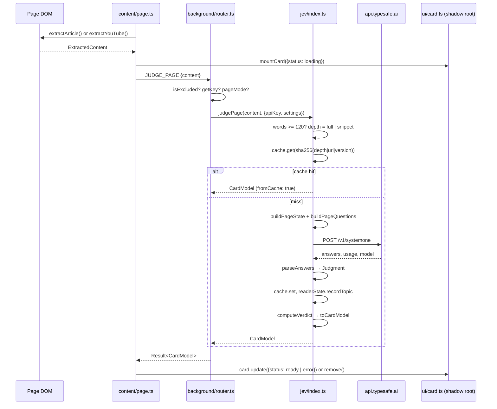

# Architecture

Winnow is a Chrome MV3 extension with three runtime contexts and one external dependency, Jev. This page maps the modules, the data that flows between them, and the design decisions that shape the code. Read [how-judgments-work.md](how-judgments-work.md) for what happens inside a judgment and [jev-contract.md](jev-contract.md) for the observed API.

## Contexts

| Context | Files | Runs where | Talks to |
|---|---|---|---|
| Content scripts | `src/content/page.ts`, `src/content/feed.ts` | Every `<all_urls>` top frame at `document_idle` | The page DOM, the service worker via `chrome.runtime.sendMessage`, and (page mode on YouTube) YouTube's same-origin caption endpoints |
| Service worker | `src/background/index.ts` → `router.ts` | The extension's background | `chrome.storage.local`, `api.typesafe.ai`, and (prefetch on) feed link targets |
| Extension pages | `src/onboarding/`, `src/options/` | `chrome-extension://` tabs | The service worker; options also reads `reader_state` directly from storage |

`manifest.json` declares `storage` and `unlimitedStorage`, the host permission `https://api.typesafe.ai/*`, and `<all_urls>` as an *optional* host permission that only the prefetch toggle requests.

## Modules

```
src/types.ts            frozen contracts: Jev wire types, enums, Judgment, CardModel, Settings, messages
src/config.ts           model pin, endpoints, retry policy, caps, cache limits, THRESHOLD_META, storage keys
src/background/
  index.ts              onMessage listener, onInstalled → onboarding tab, action click → options
  router.ts             handle(): auth of privileged messages, exclusion check, dispatch to jev/
  storage.ts            settings (merged over defaults) and the API key
  messaging.ts          typed sendMessage wrapper used by both sides
src/jev/
  client.ts             callJev(): validation, fetch, retries, error typing (Node-compatible)
  questions.ts          QUESTIONS specs, state builders, parseAnswers (pure, Node-compatible)
  verdict.ts            computeVerdict(), densityDisplay(), payloadTimestamps(), toCardModel() (pure)
  cache.ts              judgment cache in chrome.storage.local
  readerState.ts        goals, topics, feedback, summarizeForState()
  index.ts              judgePage(), judgeFeed(), cancelFeed(), verifyKey()
src/extract/
  article.ts            Readability + fallbacks, caps, reading time
  youtube.ts            video id, player response, InnerTube caption tracks, json3/XML parsing
  feed.ts               HN / YouTube / generic scanners, detectFeed(), IntersectionObserver plumbing
  prefetch.ts           string-based HTML text extraction and a bounded-concurrency fetch queue
src/ui/
  card.ts               mountCard(), renderCardBody(), renderState(); shadow root
  badge.ts              attachBadge(); pill + hover/focus popover; shadow root
  templates.ts          every user-visible string
  styles.ts             one stylesheet for both shadow roots, light and dark
```

`src/jev/client.ts`, `questions.ts`, `verdict.ts`, and `readerState.summarizeForState` have no `chrome.*` references, which is what lets `scripts/eval/run.ts` reuse them in Node.

## Message protocol

Everything crossing a context boundary is a discriminated union in `src/types.ts`. Replies are always `Result<T> = { ok: true; value: T } | { ok: false; error: JudgeError }`.

Content script → service worker (`ContentMessage`):

| `type` | Payload | Reply `value` | Notes |
|---|---|---|---|
| `JUDGE_PAGE` | `content: ExtractedContent` | `CardModel` | Page mode. Fails with `excluded_host`, `no_key`, `disabled`, `content_too_short`, `jev_error`, `internal` |
| `JUDGE_FEED` | `pageUrl`, `adapter: FeedAdapterId`, `items: FeedItem[]` | `FeedResult` (`cards` keyed by URL, `usage`, `cacheHits`) | Per-item results; a Jev failure marks each item in that chunk, never the whole call |
| `FEED_CANCEL` | `pageUrl`, `urls: string[]` | `null` | Items scrolled far away |
| `FEEDBACK` | `url`, `title`, `action: "read" \| "skip"` | `null` | Appends to the reader-state log |
| `GET_SETTINGS` | — | `Settings` | Feed script reads `feedMode` and `feedSites` before scanning |
| `GET_STATUS` | — | `Status` (`hasKey`, `model`, `cacheEntries`, `readerStateVersion`) | |

Extension page → service worker (`PageMessage`):

| `type` | Payload | Reply `value` | Notes |
|---|---|---|---|
| `SET_KEY` | `key` | `{ model }` | Verifies with `GET /v1/models` before storing |
| `CLEAR_KEY` | — | `null` | |
| `SET_SETTINGS` | `settings: Settings` | `null` | Whole object; options collects the entire form |
| `SET_GOALS` | `goals` | `null` | Bumps `readerState.version` if the text changed |
| `CLEAR_CACHE` | — | `null` | |
| `RESET_READER_STATE` | — | `null` | Goals, topics, and feedback back to defaults, version back to 1 |
| `GET_SETTINGS`, `GET_STATUS` | — | as above | |

`router.ts` keeps a `PRIVILEGED` set (`SET_KEY`, `CLEAR_KEY`, `SET_SETTINGS`, `SET_GOALS`, `CLEAR_CACHE`, `RESET_READER_STATE`) and rejects those unless `sender.tab.url` (or `sender.url`) starts with `chrome-extension://`. A content script on a hostile page cannot rotate your key or turn off exclusions.

`JudgeErrorCode` is the vocabulary the UI keys its error text on (`src/ui/templates.ts` → `ERROR_TEXT`). `page.ts` treats `excluded_host`, `disabled`, `no_key`, and `content_too_short` as "show nothing"; `feed.ts` treats `excluded_host`, `disabled`, and `no_key` as fatal and stops observing.

## Where the key lives

Only in `chrome.storage.local` under `jev_api_key`, read by `getKey()` in `src/background/storage.ts` and passed into `JudgeContext.apiKey` inside the service worker. It is never in a message reply, never in a `Result`, never logged (`router.log` prints message type and error code only, and is off unless `DEBUG` is flipped), and never available to content scripts. For the eval harness and probe script it lives in a gitignored `.env` as `JEV_API_KEY`.

## Why the service worker is the only Jev caller

Three reasons, all in the code:

1. **Key isolation.** Content scripts run in the page's world. If they could call Jev they would need the key, and the page could observe the request.
2. **One cache, one reader state.** `judgePage` and `judgeFeed` share `cache.ts` and `readerState.ts` through a single storage owner, so concurrent tabs do not race each other on the index. `cache.set` serializes writes for the same reason.
3. **One set of host permissions.** `https://api.typesafe.ai/*` is granted to the extension, not to every page. Prefetching feed link targets also happens here because it is the only context that can be granted `<all_urls>` for fetch.

## Page mode



`page.ts` runs only in the top frame, re-runs on YouTube's `yt-navigate-finish` event, and uses a `runId` counter so a stale reply from a previous navigation is dropped. Read/Skip clicks send `FEEDBACK`; Skip-to chips set `video.currentTime` and play.

## Feed mode

```mermaid
sequenceDiagram
  participant DOM as Feed DOM
  participant AD as extract/feed.ts adapter
  participant CS as content/feed.ts
  participant SW as background/router.ts
  participant J as jev/index.ts
  participant PF as extract/prefetch.ts
  participant API as api.typesafe.ai

  CS->>SW: GET_SETTINGS
  SW-->>CS: Settings
  CS->>AD: detectFeed(document, url, feedSites)
  AD->>DOM: scan(): .athing / ytd-*-renderer / a[href]
  AD->>DOM: IntersectionObserver near (200px) and far (600px)
  DOM-->>AD: items intersect
  AD->>AD: coalesce 400 ms
  AD-->>CS: onVisible(batch)
  CS->>CS: attachBadge(loading) per new URL
  CS->>SW: JUDGE_FEED {adapter, items}
  SW->>J: judgeFeed(items, ctx, {prefetch?})
  J->>J: cache.getBatch(urls, [full, snippet])
  opt prefetchLinkText and <all_urls> granted
    J->>PF: fetchText(url) ×misses, 3 concurrent
    PF-->>J: ≤3,000 chars each
  end
  J->>J: drop cancelled; chunk 12 per call
  par one call per chunk
    J->>API: POST /v1/systemone (items[], i<n>_<question>)
    API-->>J: answers
    J->>J: parseAnswers per item, cache.set(...)
  end
  J-->>SW: FeedResult {cards, usage, cacheHits}
  SW-->>CS: Result<FeedResult>
  CS->>CS: badge.update per URL; missing key → badge removed
  DOM-->>AD: item leaves far margin
  AD-->>CS: onHidden(urls)
  CS->>SW: FEED_CANCEL {urls} (pending ones only)
  SW->>J: cancelFeed(urls); prefetcher.cancel(urls)
```

### Batching

`makeAdapter` in `src/extract/feed.ts` collects intersecting elements and flushes them to `onVisible` after a 400 ms timer, so a fast scroll produces one message instead of thirty. (`FEED_BATCH_DEBOUNCE_MS = 400` exists in `config.ts` but the adapter uses its own 400 ms constant.) `judgeFeed` then de-duplicates by URL, looks the whole set up in the cache in one storage read, and splits misses into chunks of `FEED_BATCH_SIZE = 12`. Each chunk is one Jev request: `state.items[n]` holds each item, and question ids are prefixed `i<n>_` (`buildFeedRequest`). Chunks run in parallel with `Promise.all`; a failed chunk marks each of its items with the same `jev_error` rather than failing the message.

### Cancellation on scroll-away

The adapter's second IntersectionObserver has a 600 px margin and only reports elements that were previously reported visible. `feed.ts` filters those URLs to ones still `pending` (no result yet), removes their badges, and sends `FEED_CANCEL`. In the service worker `cancelFeed` adds the URLs to a `cancelled` set and aborts any in-flight prefetch for them; `prefetcher.cancel` also drops queued jobs. Items in `cancelled` are excluded when `judgeFeed` builds its `pending` list. A Jev call already in flight is not aborted (`judgeFeed` calls `callJev` without a signal); its results are still cached, and the content script ignores them because the badge is gone. A fresh `JUDGE_FEED` for a URL clears its cancelled flag.

## Cache keying

`src/jev/cache.ts` stores each `Judgment` under `c:` + `sha256("<depth>|<url>|<readerStateVersion>")` in `chrome.storage.local`, with an index array `cache_index` of `{key, at}` in insertion order.

- **depth** is `full` or `snippet`, so a title-only feed judgment never masquerades as a full-body one. Feed lookups ask for `["full", "snippet"]` and prefer `full`.
- **url** is the normalized item URL (`normalizeUrl` strips the hash and `utm_*` params for feed items; page mode uses `location.href`).
- **readerStateVersion** bumps whenever goals change, which invalidates everything at once. Topic and feedback changes do not bump it.
- Entries older than `CACHE_TTL_MS` (7 days) are dropped on read.
- The index is capped at `CACHE_MAX_ENTRIES` (3,000); the oldest by insertion are evicted on write. Reads do not refresh position.
- Writes go through a promise chain (`serialized`) because `chrome.storage` has no transactions and feed chunks finish concurrently.

## Reader-state summary

`ReaderState` (`reader_state` in storage) holds `version`, `goals`, `topics: TopicCount[]`, and `feedback: FeedbackEntry[]`. What Jev sees is `summarizeForState(rs)`:

| Field | Source | Cap |
|---|---|---|
| `goals` | options textarea | first 600 chars |
| `frequent_topics` | `topics` seen within 30 days, sorted by count | top 6 |
| `recently_read_titles` | last 8 `read` feedback entries, newest first | 80 chars each |
| `recently_skipped_titles` | last 8 `skip` entries | 80 chars each |

If the JSON exceeds `READER_SUMMARY_MAX_CHARS` (2,400), lists are trimmed skipped-titles first, then read-titles, then topics, then goals in 100-char steps. Topics are recorded only by `judgePage`, not by feed judgments. The feedback log is capped at `FEEDBACK_LOG_MAX` (200).

## Shadow DOM isolation

Both `mountCard` and `attachBadge` create a host element, call `attachShadow({ mode: "open" })`, and append a `<style>` with `STYLES` plus the UI. `:host { all: initial }` resets inherited page styles; the page's stylesheets cannot select inside the root, and Winnow's selectors cannot leak out. The card host is `position: fixed` at `z-index: 2147483647`. Dark mode follows `prefers-color-scheme`, or a `data-wi-theme` attribute on an ancestor for the dev preview. Feed badges are inserted with `insertAdjacentElement("afterend", ...)` next to the title anchor and marked with `data-winnow="1"` on the element so rescans skip them.

## Error typing

Two layers, both closed unions in `src/types.ts`:

- `JevError.kind`: `auth` (401), `bad_request` (400/422, our bug, never retried), `rate_limit` (429), `overloaded` (5xx including 529), `network` (fetch threw, 408, or the 15 s timeout), `malformed_response` (200 but the body failed `validateResponse` or `parseAnswers`). `client.ts` retries `rate_limit`, `overloaded`, and `network` up to 2 times with 500 ms → 5 s jittered backoff, honouring `retry-after` up to 60 s. It accepts all three observed `detail` shapes when building the message.
- `JudgeError.code`: `no_key`, `excluded_host`, `disabled`, `content_too_short`, `jev_error` (carries the `JevError`), `internal` (anything that threw in `handle`; message is a fixed string). The UI maps each code to a template string and, for `jev_error`, appends the Jev message beneath it.

## Exclusions

`isExcluded(pageUrl, excludedHosts)` in `router.ts` returns true for any URL that is not `https:`, any hostname matching the private/loopback regex (`localhost`, `127.*`, `10.*`, `192.168.*`, `172.16–31.*`, `169.254.*`, `0.*`, `[::1]`, `[fc..]`/`[fd..]`, `[fe80..]`), or any host equal to or a subdomain of an entry in the user's list. The check runs in the service worker on every `JUDGE_*` message, so a content script cannot bypass it. Defaults are in `config.DEFAULT_EXCLUDED_HOSTS` (mail, docs, Notion, localhost).

## Build

Vite + `@crxjs/vite-plugin` read `manifest.json` and emit `dist/` with the service worker loader, content scripts, and pages. `src/onboarding/index.html` is not in the manifest so `vite.config.ts` adds it as an extra rollup input. Tests use Vitest with `happy-dom` where a DOM is needed (`// @vitest-environment happy-dom` at the top of the file).
