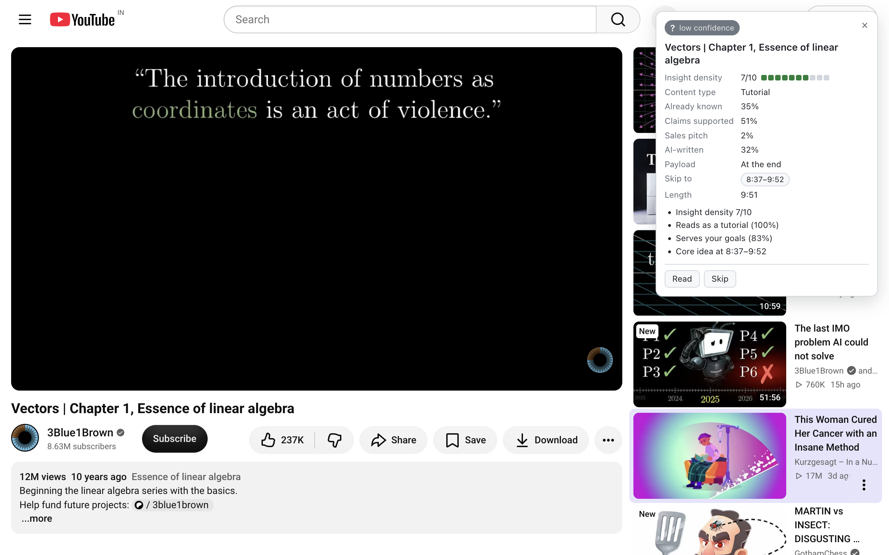

# Install

Winnow is a Chrome MV3 extension. It is not on the Chrome Web Store yet, so you install it from a release zip as an unpacked extension. You also need a Jev API key from TypeSafe.

## Requirements

- Google Chrome (or another Chromium browser that supports MV3 and `chrome://extensions`). Firefox is not supported.
- A Jev API key from [console.typesafe.ai](https://console.typesafe.ai). Jev bills per input token; a Hacker News front page costs about $0.0015, a long article well under a cent.

## 1. Download

Go to https://github.com/ThinkyMiner/Winnow/releases/latest and download the asset named `Winnow-vX.Y.Z.zip`. Unzip it somewhere you will not delete (Chrome loads the extension from this folder every time it starts). The folder contains `manifest.json`, `service-worker-loader.js`, `assets/`, `icons/`, and `src/`.

## 2. Load unpacked

1. Open `chrome://extensions`.
2. Turn on **Developer mode** (top right).
3. Click **Load unpacked** and pick the unzipped folder.

Winnow appears in the list and its icon in the toolbar (you may need to pin it from the puzzle-piece menu).

## 3. Enter your key

The onboarding page opens in a new tab on first install.

Paste your key and click **Verify**. Winnow makes one request to `GET https://api.typesafe.ai/v1/models` with the key and stores it only if that succeeds. On success it shows the pinned model name (`jev-1.13.0`) and a link to options.

If the page did not open, or you closed it: click the toolbar icon to open options and use the **API key** section at the bottom; it does the same verification.

## 4. Set your goals (optional but recommended)

Click the Winnow toolbar icon. Under **Reading goals**, describe what you want to get out of your reading in plain text, e.g. "Deepen my distributed systems knowledge; skip AI hype; I already know Rust basics." Click **Save goals** (or just click away). Every judgment sends this text, and the `serves_reader_goals` and `already_known_to_reader` questions are asked relative to it. Without goals, Jev is told to judge for "a curious generalist who wants to learn something new".

## 5. Try it

Open any article of a few hundred words on an `https:` site. A card appears in the top-right corner within a second or two.

Open https://news.ycombinator.com. Each title gets a small badge; hover it for the full card.

Open a YouTube video with captions. The card includes **Skip to** chips.

## Troubleshooting

### No card appears on a page

In order of likelihood:

1. **The page is `http:`, `localhost`, or on a private network.** Winnow refuses these unconditionally.
2. **The host is excluded.** Check **Excluded hosts** in options. Defaults include webmail, Google Docs, and Notion. A host entry also matches all its subdomains.
3. **The page is too short.** Articles need at least 120 words of readable text (after Mozilla Readability, or the `<article>`/`<main>`/`
` fallback). Paywalled teasers often fail this. Videos without captions need a description of at least 200 characters.
4. **No key.** The options page status line at the top says "Key set" or "No key".
5. **Page mode is off.** Options → Modes → **Page mode**.
6. **You are in an iframe or a reader view.** The content script runs in the top frame only.
7. **You dismissed it.** Press the × or Escape and it stays gone until you navigate. On YouTube it comes back when you move to another video.

All of these are silent by design; the card only shows an error state when Jev itself failed ("Jev couldn't judge this", with the API's message beneath).

### Badges are missing in a feed

1. **Feed mode is off**, or the specific site toggle (Hacker News / YouTube / Other link lists) is off. Both are under Options → Modes.
2. **Not a recognised feed page.** Hacker News badges appear on `/`, `/news`, `/newest`, `/best`, `/ask`, `/show`, and `/front`, not on comment threads. YouTube badges appear on the home page, `/feed/*` (subscriptions, history…), and `/results` (search), not on watch pages or Shorts shelves. Any other page needs at least 15 links to *other* hosts with titles of 15+ characters, outside `nav`/`header`/`footer`, before the generic adapter turns on.
3. **Excluded host, no key**, as above. These stop the feed script entirely.
4. **Items have not scrolled into view.** Badges attach when an item comes within 200 px of the viewport; a batch is sent 400 ms after the last one appears.
5. **You scrolled past quickly.** Items that leave a 600 px margin while still loading are cancelled and their badges removed. Scroll back and they are requested again.

A badge showing `!` means that item's judgment failed; hover for the message. A badge showing `?` means the verdict's confidence is below your **Min confidence** slider; hover to see the full card anyway.

### "That key was rejected"

The models endpoint returned 401. Check that you copied the whole key from [console.typesafe.ai](https://console.typesafe.ai) and that it has not been revoked there. Any other message on the onboarding or key form is the API's own error text or a network failure ("timeout after 15000ms" means api.typesafe.ai did not answer).

### YouTube: no Skip-to chips

Chips need a caption track. Winnow asks YouTube's InnerTube player endpoint (as the iOS client) for caption tracks and falls back to the tracks listed in the page; it prefers an English, non-auto-generated track, then English auto-generated, then whatever is first. If the video has no captions at all, or YouTube changed the endpoint, the card is still shown but judged from title and description, without a "Skip to" row or a "Core idea at" reason. Reopen the video after a page reload if you navigated to it inside YouTube; the extractor discards stale player data from the previous video and refetches.

If chips are missing on a video that clearly has captions, that is a bug worth a [report](https://github.com/ThinkyMiner/Winnow/issues/new?template=bug.yml) with the URL.

### The card looks wrong or is hidden behind something

The card is rendered in a shadow root at the highest z-index and `position: fixed; top: 16px; right: 16px`. Sites with their own fixed top-right elements can overlap it; the card cannot be dragged yet, so dismiss it with × or Escape if it is in the way. Dark mode follows your OS setting.

## Updating

1. Download the new zip from https://github.com/ThinkyMiner/Winnow/releases/latest.
2. Delete the contents of the folder you loaded and unzip the new build into it (or unzip somewhere new).
3. Open `chrome://extensions` and click the reload icon on the Winnow card. If you used a new folder, remove the old entry and **Load unpacked** the new one.

Your key, settings, reader state, and cache are kept in extension storage and survive a reload. Reuse the same folder: an unpacked extension's id is derived from its folder path, so loading from a new folder creates a new extension with empty storage.

Cached judgments are keyed by URL, depth, and your goals version, not by extension version. If a release changes the questions or thresholds, click **Clear cache** in options to re-judge things you have already seen.

## Uninstalling

`chrome://extensions` → Winnow → **Remove**. Chrome deletes the extension's storage (key, settings, reader state, cache) with it. If you turned on "Prefetch link text", the `<all_urls>` grant goes with the extension too. Then delete the unzipped folder. Nothing was ever stored anywhere else; see [privacy.md](privacy.md).

## For developers

Building from source and loading `dist/` is described in [development.md](development.md), including the note about Chrome 137+ ignoring `--load-extension`.
